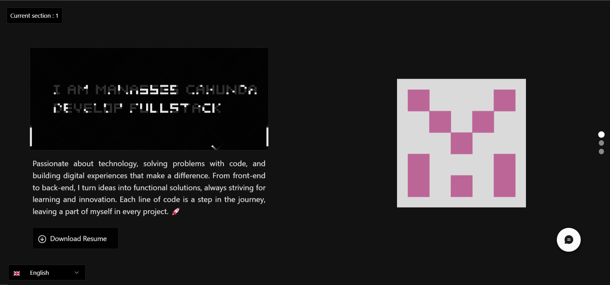
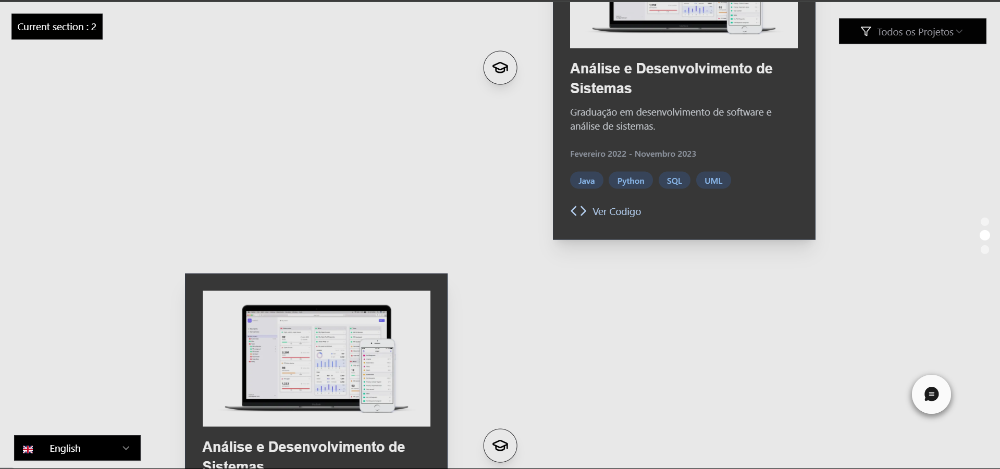

# 🚀 Projeto Next.js

Este é um projeto criado com [Next.js](https://nextjs.org), inicializado com [`create-next-app`](https://nextjs.org/docs/app/api-reference/cli/create-next-app).

---

## 📸 Preview

<div align="center">
  
  <br/>
  
  <br/>
  
</div>

---

## 🛠️ Começando

Para rodar o ambiente de desenvolvimento, utilize um dos comandos abaixo:

```bash
npm run dev
# ou
yarn dev
# ou
pnpm dev
# ou
bun dev
```

Abra [http://localhost:3000](http://localhost:3000) no seu navegador para ver o resultado.

A página pode ser editada no arquivo `app/page.tsx`. As alterações são aplicadas automaticamente enquanto você edita.

---

## 🎨 Tecnologias

- **Next.js** — Framework React para aplicações modernas.
- **TypeScript** — Tipagem estática para JavaScript.
- **next/font** — Otimização automática de fontes (utilizando [Geist](https://vercel.com/font)).

---

## 📚 Saiba Mais

Quer aprender mais sobre Next.js? Aqui vão alguns links úteis:

- [Documentação oficial do Next.js](https://nextjs.org/docs) — Recursos e API.
- [Tutorial interativo do Next.js](https://nextjs.org/learn).

Você também pode visitar o [repositório oficial no GitHub](https://github.com/vercel/next.js) para contribuir ou deixar seu feedback!

---

## ☁️ Deploy na Vercel

A forma mais simples de colocar sua aplicação Next.js no ar é através da [plataforma Vercel](https://vercel.com/new?utm_medium=default-template&filter=next.js&utm_source=create-next-app&utm_campaign=create-next-app-readme), criada pelos próprios desenvolvedores do Next.js.

Consulte a [documentação de deploy do Next.js](https://nextjs.org/docs/app/building-your-application/deploying) para mais detalhes.

---

## 📄 Licença

Este projeto está licenciado sob a [MIT License](LICENSE).

---

Se quiser posso adicionar também um cabeçalho com título, badge de status, ícones sociais, etc. Quer que eu inclua?
